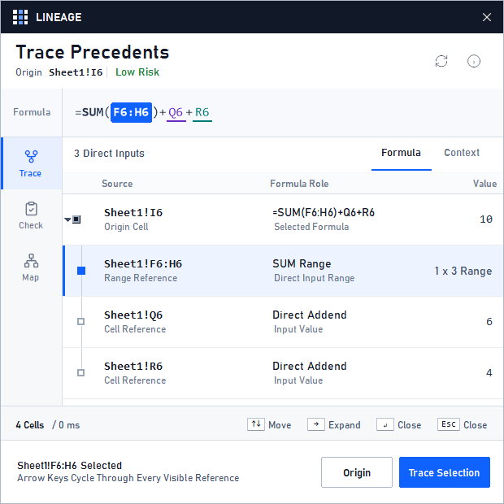
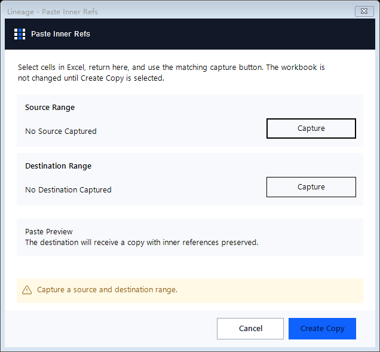
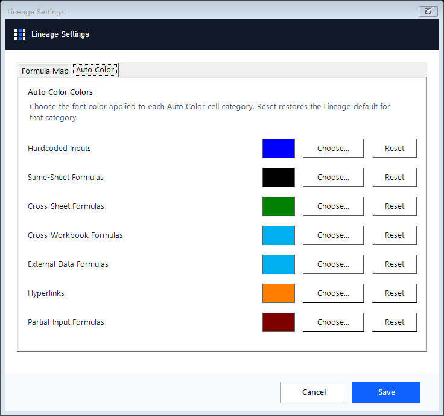
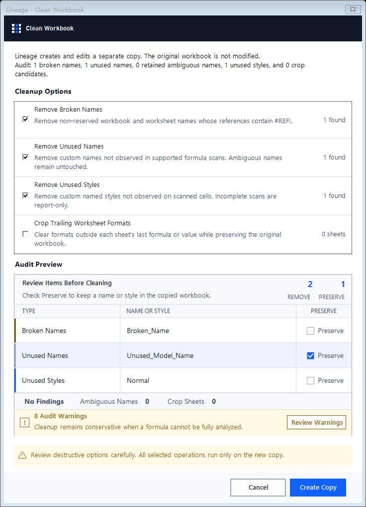
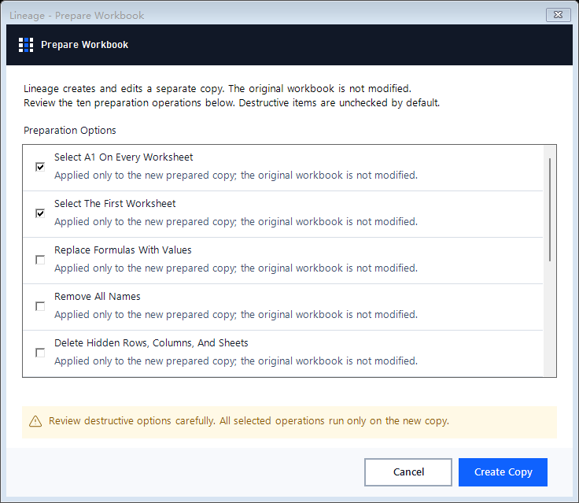

# Lineage

**Trace, audit, build, format, and prepare financial models without leaving Excel.**

Windows desktop Excel · x64 and x86 · Unsigned Preview 1.5.0 · [MIT License](LICENSE)

[Installation](INSTALL.md) · [Support](SUPPORT.md) · [Rollback](ROLLBACK.md) · [Security](SECURITY.md)

<p align="center">
  
</p>

Lineage turns formula relationships into a navigable hierarchy. Trace inputs and outputs, inspect formula roles, move between referenced cells, and return to the origin without manually following cell addresses.

> [!WARNING]
> **Unsigned preview for trusted testers.** Windows cannot currently verify Lineage's publisher. This preview is not the signed-production channel. Verify the supplied checksums and read the [installation instructions](INSTALL.md) before installing.

## Why Lineage?

Financial models are difficult to review because important relationships are distributed across formulas, worksheets, names, formats, and workbook settings. Lineage brings those workflows into one native Excel tab:

- **Understand models faster:** trace precedents and dependents through a structured, keyboard-navigable hierarchy.
- **Find inconsistencies:** inspect formula patterns, cross-sheet links, external references, numeric inputs, and suspicious formulas.
- **Build more efficiently:** insert recurring modeling formulas and transform selected cells without rewriting formulas manually.
- **Prepare safer deliverables:** audit names, styles, formatting, hidden content, and workbook settings before distribution.
- **Protect the source workbook:** Clean Workbook and Prepare Workbook create and modify separate copies.

## Trace Formula Lineage

Trace Precedents and Trace Dependents show direct and nested relationships for the selected formula. The Lineage pane identifies the origin, cells and ranges, formula roles, values, risk indicators, and expandable branches.

Use the arrow keys to move through visible references. **Origin** returns to the starting cell.

| Action | Default shortcut |
|---|---|
| Trace Precedents | `Ctrl` + `Shift` + `[` |
| Trace Dependents | `Ctrl` + `Shift` + `]` |

Lineage does not register or intercept other keyboard shortcuts.

## Audit Models

- **Formula Check** finds broken copy-across formula patterns.
- **Formula Map** applies a reversible color overlay to formula-pattern groups.
- **Horizontal Check** compares selected formulas for horizontal inconsistencies.
- **Workbook Map** maps dependencies and shortest paths to model outputs.
- **Numeric Inputs** selects numeric constants.
- **Quasi Inputs** selects formulas with no statically resolved references.
- **Cross Sheet Refs** selects formulas referring to another worksheet.
- **External Refs** selects formulas referring to another workbook.

## Build and Replicate

| Tool | Purpose |
|---|---|
| IFERROR Wrap | Wrap selected formulas with `IFERROR` and the literal text `"NA"` |
| Insert CAGR | Insert a two-decimal percentage CAGR from the contiguous numeric series to the left |
| Switch Sign | Reverse selected formulas and numeric constants |
| Multiply By | Multiply selected formulas and values by a supplied factor |
| Smart Fill | Fill blank formula gaps using matching surrounding formulas |
| Copy Sum | Copy the numeric sum of the selection |
| Replace Formulas | Replace text inside selected formulas using a regular expression |
| Paste Inner Refs | Duplicate a range using Excel reference translation |
| Paste Exact Copy | Copy formulas, values, and formats while preserving formula text exactly |

### Paste Inner References

Capture a source range and destination range, review the operation, and create the translated copy. The workbook is not changed until **Create Copy** is selected.

<p align="center">
  
</p>

## Format Financial Models

### Auto Color

Auto Color categorizes hardcoded inputs, same-sheet formulas, cross-sheet formulas, cross-workbook formulas, external-data formulas, hyperlinks, and partial-input formulas. Each category can be customized from Lineage Settings.

<p align="center">
  
</p>

Additional formatting tools include:

- **Auto-Fit:** fits selected column widths, then restores selected rows to the worksheet's default height.
- **Center Across:** centers text across the selection without merging cells.

## Clean Workbooks

Clean Workbook audits the model before changing anything. It identifies removable names, styles, and trailing worksheet formatting while allowing individual findings to be preserved.

<p align="center">
  
</p>

The audit covers broken non-reserved names, unused workbook and worksheet names, unused custom styles, trailing worksheet formats, ambiguous names, and conservative-scan warnings. Lineage creates a separate cleaned copy; the original workbook is not modified.

## Prepare Workbooks for Distribution

Prepare Workbook provides a reviewable checklist for producing a sharing-ready copy. Potentially destructive options are unchecked by default.

<p align="center">
  
</p>

## Complete Feature Map

| Ribbon section | Commands |
|---|---|
| **Trace** | Trace Precedents, Trace Dependents |
| **Audit** | Formula Check, Formula Map, Horizontal Check, Workbook Map, Numeric Inputs, Quasi Inputs, Cross Sheet Refs, External Refs |
| **Build** | IFERROR Wrap, Insert CAGR, Switch Sign, Multiply By, Smart Fill, Copy Sum, Replace Formulas, Paste Inner Refs, Paste Exact Copy |
| **Format** | Auto Color, Auto-Fit, Center Across |
| **Publish** | Clean Workbook, Prepare Workbook, Select A1, Toggle Gridlines, Un-Hide/Re-Hide, Remove Page Breaks, Single Page Break |
| **Settings** | Circular Calculations, Show Lineage, Lineage Settings |

## Install the Unsigned Preview

### Requirements

- Windows 10 or Windows 11 supported by Microsoft
- Desktop Microsoft Excel using the Office 16.0 registry model
- x64 or x86 Excel
- .NET Framework 4.8 or later
- PowerShell 7

### Download

Download these five matching files from [`preview/1.5.0`](preview/1.5.0):

- `Lineage-Native-1.5.0.zip`
- `Lineage-Unsigned-Preview-Bootstrap-1.5.0.ps1`
- `Lineage-Unsigned-Preview-1.5.0.json`
- `SHA256SUMS.txt`
- `Lineage-1.5.0.spdx.json`

Close Excel, verify the published SHA-256 values, and run PowerShell 7 from the download directory:

```powershell
pwsh -NoProfile -File .\Lineage-Unsigned-Preview-Bootstrap-1.5.0.ps1 `
  -ZipPath .\Lineage-Native-1.5.0.zip `
  -ChecksumsPath .\SHA256SUMS.txt `
  -Action Install `
  -AcceptUnsignedPreviewRisk
```

See [INSTALL.md](INSTALL.md) for the complete verification, installation, upgrade, and uninstall procedure.

## Safety Model

- Clean Workbook and Prepare Workbook operate on separate copies.
- Direct-editing commands register Lineage-managed undo snapshots where Excel permits exact restoration.
- Installation uses a narrow per-user Excel Trusted Location.
- The bootstrap verifies the archive checksum and exact internal package manifest before launching the installer.
- Preview installation cannot overwrite a signed-production installation.
- Checksums establish integrity against this repository; they are not a Windows publisher signature.

## License, Disclaimer, and Acknowledgements

### Preview Software and Use at Your Own Risk

Lineage is preview software and may contain bugs, incomplete functionality, compatibility problems, or other errors. Its operations may affect workbook formulas, values, formatting, names, print settings, worksheet visibility, calculation settings, or Excel configuration.

Back up important workbooks, test unfamiliar operations on disposable copies, review every resulting workbook before relying on or distributing it, and retain the original workbook until the result has been independently verified.

Lineage is not a substitute for professional financial, accounting, investment, tax, legal, regulatory, audit, or information-security review. Do not use Lineage as the sole control for a material business decision or published financial model.

### Disclaimer of Warranty and Liability

To the maximum extent permitted by applicable law, Lineage is provided **"AS IS"** and **"AS AVAILABLE,"** without warranties of any kind, express or implied, including warranties of merchantability, fitness for a particular purpose, accuracy, reliability, availability, non-infringement, or freedom from defects.

The authors, maintainers, contributors, and distributors are not liable for claims, data loss, corrupted or altered workbooks, business interruption, lost profits, inaccurate calculations, or any other direct, indirect, incidental, special, exemplary, or consequential loss arising from the use of, or inability to use, Lineage.

This summary is provided for readability. The controlling warranty and liability terms are those in the [MIT License](LICENSE).

### License

Lineage's original code and documentation are licensed under the [MIT License](LICENSE). Third-party libraries, icons, trademarks, documentation, and other components remain subject to their respective licenses and terms. The Lineage MIT License does not replace or modify those third-party licenses.

### Third-Party Projects and Acknowledgements

Lineage was built using open-source components and was informed by publicly documented Excel tools, financial-modeling practices, and community projects. Material direct dependencies include [Excel-DNA](https://github.com/Excel-DNA/ExcelDna) under the Zlib License, [SVG.NET](https://github.com/svg-net/SVG) under the Microsoft Public License, and selected [Lucide](https://lucide.dev/) icon assets under the ISC License.

References to publicly described functionality indicate inspiration and interoperability research; they do not imply sponsorship, endorsement, affiliation, ownership, or incorporation of third-party source code. Third-party trademarks remain the property of their respective owners. See [THIRD_PARTY_NOTICES.md](THIRD_PARTY_NOTICES.md) and the published [SPDX software bill of materials](preview/1.5.0/Lineage-1.5.0.spdx.json) for additional details.

Microsoft and Excel are trademarks of the Microsoft group of companies. Lineage is an independent project and is not affiliated with, endorsed by, or sponsored by Microsoft.

## Support and Recovery

- [Supported platforms and installation behavior](SUPPORT.md)
- [Rollback and workbook recovery](ROLLBACK.md)
- [Security reporting and preview limitations](SECURITY.md)

When reporting a problem, include the Lineage version, Excel architecture, Windows version, command used, and exact error text. Do not attach confidential workbooks or workbook contents to a public issue.

## Distribution Repository

The Lineage application source is maintained separately in a private repository. This public repository contains distribution assets and user-facing documentation.
